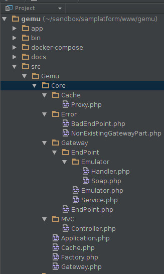
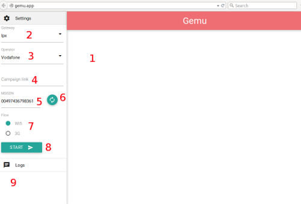

# Gateway Emulator (gemu)

## Structure

There are 7 folders inside of emulator: app, bin, docker-compose, docs, src, vendor, web. 
Each one of the folder serving its own purpose.

* app - templates, wsdls, configurations(soon to be added)
* bin - additional utility files such as composer.
* docker-compose - docker compose builds and configuration files.
* docs - files that are used for README.md
* src - project PHP code
* vendor - third party dependencies
* web - web root directory

## Root of evil

Project php files are located in two folders named Core and Gateway. 
Core folder holds all code that is generic and the gateway folder holds individual implementation 
of each gateway.

### Core structure



* Application.php - all configurations that needs to be done before application launches must be
done here. Ex. creating twig templating engine.
* Cache.php - class that handles any interaction with cache.
* Factory.php - class that creates other classes that are needed for this project.
* Gateway.php - class wrapper that holds both service and emulator implementation. _Soon to be removed_
* Cache\Proxy.php - wrapper that will persist transaction_id inside so you wont need to pass transaction_id for 
transaction based queries.
* Error - folder that holds gemu specific errors.
* Gateway\EndPoint.php - base class which resolves endpoint name from requests and tries to call it.
* Gateway\EndPoint\Emulator.php - base class that will handle emulation of HTTP based requests.
* Gateway\EndPoint\Service.php - base class that handles requests for non-gateway endpoints.
* Gateway\EndPoint\Emulator\Handler.php - trait that is responsible for logging requests&responses from emulated endpoints.
* Gateway\EndPoint\Emulator\Soap.php - base class that handles emulation of SOAP&HTTP requests.

### How it works

1. Request comes to route _{purpose}/{gateway}/{endPoint}_
2. Check purpose url attribute. Should be emulate or service. 
3. Try to create gateway with name from gateway url attribute. If failed throws NonExistingGatewayPart exception.
4. Gateway calls emulator or service object and pass it request.
5. Function getEndPoint from emulator or service object returns method name. If failed throws BadEndPoint exception.
6. If purpose is service it will call the method and return response.
7. If purpose is emulate and emulator is HTTP based. Then will trigger **Handler trait** \_\_call method
and log request based on return of **getTransactionId** and **getData** functions.
8. If purpose is emulate and emulator is SOAP based. Then it will try to create SOAP server to handle the request if not
request will be handled like an HTTP based one. Log request and response based on **getTransactionId** and **getData** functions
in SOAP handler class or Emulator class based on previous step.

## UI



1. Iframe with emulated ad. Will be loaded after "Start button"(8) is pressed 
and input validation is successful.
2. Select with gateway name is used only to populate operator select.
3. Operator select. Value of which will be used as a return for identification flow.
4. Link to the campaign that will be tested with emulator.
5. Input for msisdn. Is filled automatically on startup.
6. Button to generate new msisdn.
7. Radio button group for selecting flow. This will affect emulator response for identification flow.
8. Start button. Starts a emulator session.
9. Log section. This part will be populated by called endpoints names, requests to them 
and responses from them.

## How to add new gateway

Right now gemu supports two generic types of gateways: SOAP, HTTP. 
Gemu will automatically add logs for each endpoint call so no need to worry about that.
Lets see how to add both of these types.

### Adding SOAP gateway

1. Create folder with gateway name inside of src/Gemu/Gateway.
2. Create two files called Service.php and Emulator.php. 
Extend Service.php from \Gemu\Core\Gateway\EndPoint\Service. 
Extend Gateway.php from \Gemu\Core\Gateway\EndPoint\Emulator\Soap
3. Create folder Soap inside of src/Gemu/Gateway/{gatewayName} and add Handler trait to it. 
This class will handle SOAP queries. 
4. Create mocked wsdl files inside app/wsdl/{gatewayName}
Example. If we want to mock this soap service.
```
    <service name="IdentificationApiService">
        <port name="IdentificationApi31" binding="tns:IdentificationApiBinding">
            <soap:address location="http://gemu.app/emulate/Ipx/Identification"/>
        </port>
    </service>
```
We need to create wsdl file app/wsdl/{gatewayName}/Identification.wsdl 
and src/Gemu/Gateway/{gatewayName}/Soap/Identification.php. 
**Note: wsdl file and SOAP handler files should be named same as mocked service**
5. Add operator function into Service.php.
``` 
    /**
     * Class Service
     * @package Gemu\Gateway\SomeGateway
     */
    final class Service extends \Gemu\Core\Gateway\EndPoint\Service
    {
        /**
         * @return \Symfony\Component\HttpFoundation\JsonResponse
         */
        protected function operators()
        {
            return new JsonResponse(
                [
                    '1' => 'DERP',
                    '2' => 'HERP',
                ]
            );
        }
    }
```
6. Add handler functions to Gateway.php according to wsdl. 
```
    <binding name="IdentificationApiBinding" type="tns:IdentificationApiPort">
        <soap:binding style="document" transport="http://schemas.xmlsoap.org/soap/http"/>
        <operation name="createSession">
            <soap:operation soapAction="tns:createSession"/>
            <input>
                <soap:body use="literal"/>
            </input>
            <output>
                <soap:body use="literal"/>
            </output>
        </operation>
    </binding>
```

Then we will add **protected** function into src/Gemu/Gateway/{gatewayName}/Soap/Identification.php 
```php
    protected function createSession($transactionId, array $request)
```
7. Define getTransactionId and getData functions inside src/Gemu/Gateway/{gatewayName}/Emulator.php
and src/Gemu/Gateway/{gatewayName}/Soap/{soapHanlder}.php.
8. Contemplate existance.

### Adding HTTP gateway

1. Create folder with gateway name inside of src/Gemu/Gateway.
2. Create two files called Service.php and Emulator.php.
Extend Service.php from \Gemu\Core\Gateway\EndPoint\Service. 
Extend Gateway.php from \Gemu\Core\Gateway\EndPoint\Emulator.
3. Add operator function into Service.php.
```
/**
* Class Service
* @package Gemu\Gateway\SomeGateway
*/
final class Service extends \Gemu\Core\Gateway\EndPoint\Service
{
   /**
    * @return \Symfony\Component\HttpFoundation\JsonResponse
    */
   protected function operators()
   {
       return new JsonResponse(
           [
               '1' => 'DERP',
               '2' => 'HERP',
           ]
       );
   }
}
```
4. Add **protected** functions into Emulator that will handle http requests. Ex.
live url: http://somesite.com/scope/doAction?transId=12313&subs=12313
mocked url: http://gemu.app/emulate/SomeGateway/doAction
Inside of src/Gemu/Gateway/{gatewayName}/Emulator.php
```
protected function doAction($transaction_id, array $params)
```
5. Define getTransactionId and getData functions inside src/Gemu/Gateway/{gatewayName}/Emulator.php

## How to run

1. Clone gemu.
2. Clone mcb.
3. Clone mcb-ads.
4. Clone mcb-portal.
5. Run 
```
docker-compose --file docker-compose/dev.yaml build
docker-compose --file docker-compose/dev.yaml up
```
6. **Mcb project**. Set up emulator.yaml inside of config\Sam\Mcb\Gateway\{GatewayName} 
and config\Sam\Mcb\Gateway\{GatewayName}\{countryCode} to point to your gemu application.
7. **Mcb project**. Insert data into tables: `gateway`, `country`, `service`, `scenario_service`,
`scenario`.
8. **Mcb-ads project**. Set up scenario_id inside DE/DEFAULT/config.json 
to point to scenario which you want to test. 
9. **Mcb-portal project**. Point $api variable inside GrantAccess.php to your mcb project url.
10. Provide url from mcb-ads
```
{your.mcb-ads.com}/ad.php/DEFAULT?affid=SAM&type=MCB_IN
```
to Campaign link input inside of gemu application ui
```
{localhost|vagrant.ip}:8080/web
```
(Section UI. Part 4) and press Start Button(Section UI. Part 8). 
